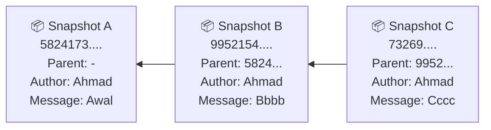
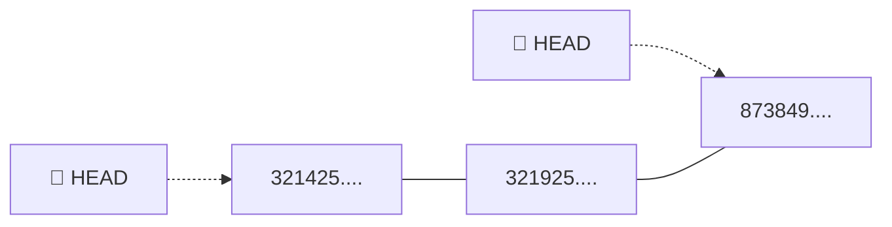

# 📸 Snapshot

## 🎯 Apa itu Snapshot?

**Snapshot** adalah rekaman lengkap dari semua perubahan yang terjadi pada project kita pada suatu waktu tertentu.

### 💡 Konsep Dasar

- Pada materi sebelumnya kita selalu menyebutkan **versi** pada perubahan file
- Sebenarnya perubahan yang dilakukan bisa jadi dilakukan secara bersamaan untuk beberapa file, hal ini berarti sebenarnya tidak ada yang namanya versi file
- Semua perubahan yang terjadi akan direkam, dan kita sebut namanya adalah **snapshot**
- Snapshot berisikan semua perubahan yang terjadi di semua file yang kita commit
- Setiap snapshot akan menghasilkan **hash**

> 💭 **Analogi Sederhana**: Bayangkan snapshot seperti foto keluarga. Satu foto bisa menangkap semua orang sekaligus, bukan foto per orang. Begitu juga snapshot menangkap semua perubahan file sekaligus dalam satu "jepretan".

---

## 🔐 Hash

### 🤔 Apa itu Hash?

**Hash** adalah kode unik yang dihasilkan oleh Git untuk mengidentifikasi setiap snapshot. Seperti sidik jari, setiap hash pasti berbeda!

### 📋 Karakteristik Hash

- Setiap snapshot yang kita lakukan, semua akan menghasilkan hash sebagai **identitas snapshot** nya
- Hash merupakan **checksum** untuk menghitung perubahan yang terjadi
- Git menggunakan algoritma **SHA-1** untuk menghitung hash
- Hash dibutuhkan untuk menjaga **data integrity**, sehingga tiap snapshot yang sudah kita lakukan tidak bisa diubah, hal ini karena akan secara otomatis merusak hash yang sudah dibuat

### 📌 Contoh Hash

```
30534aeabde65981732c6c469b7583483d379b00
```

> ⚠️ **Penting**: Hash terdiri dari 40 karakter hexadecimal (0-9, a-f). Setiap perubahan sekecil apapun akan menghasilkan hash yang berbeda total!

---

## 📊 Diagram Snapshot



### 📝 Penjelasan Diagram

Diagram di atas menunjukkan **tiga snapshot** (A, B, dan C) dengan hash unik masing-masing:

- **Snapshot A** adalah snapshot pertama (tidak memiliki parent)
- **Snapshot B** adalah snapshot kedua yang merujuk ke Snapshot A sebagai parent
- **Snapshot C** adalah snapshot ketiga yang merujuk ke Snapshot B sebagai parent

Setiap snapshot memiliki:
- ✅ **Hash unik** sebagai identitas
- ✅ **Parent** (referensi ke snapshot sebelumnya)
- ✅ **Author** (pembuat snapshot)
- ✅ **Message** (deskripsi perubahan)

> 🔗 **Catatan**: Snapshot-snapshot ini saling terhubung seperti rantai. Setiap snapshot tahu siapa "orang tua"nya, kecuali snapshot pertama.

---

## 🧮 Perhitungan Hash

### 🎲 Bagaimana Hash Dihitung?

Hash tidak hanya dihitung dari perubahan file saja, tetapi juga dari beberapa komponen:

- 📄 **Perubahan file** (isi dan nama file)
- 👤 **Author** (siapa yang membuat perubahan)
- 💬 **Message** (pesan commit)
- 🔗 **Parent** (hash snapshot sebelumnya)

### ⚡ Efek Berantai

Karena hash dihitung dari parent juga, maka:

- Artinya **perubahan yang terjadi pada snapshot sebelumnya**, maka akan menimbulkan **efek berantai**
- Karena semua hash selanjutnya akan berubah
- Oleh karena itu, hal tersebut **tidak bisa dilakukan di Git**

> 🚫 **Ingat**: Ini adalah fitur keamanan! Git melindungi history kita dari perubahan yang tidak sah. Sekali snapshot dibuat, tidak bisa diubah tanpa mengubah semua snapshot setelahnya.

---

## 🎯 HEAD

### 🤔 Apa itu HEAD?

**HEAD** adalah pointer (penunjuk) khusus yang menunjuk ke snapshot yang sedang aktif saat ini.

### 💡 Kenapa Pakai HEAD?

- HEAD merupakan **pointer menuju hash yang paling akhir**
- Karena kadang sangat menyulitkan jika harus menuliskan hash value (40 karakter!)
- Jika kita akan menuju ke hash paling baru, kita bisa gunakan kata **HEAD**

> 🎪 **Analogi**: HEAD seperti penanda "Anda di sini" di peta mall. Dia selalu menunjuk posisi kita saat ini di timeline snapshot.

---

## 📍 Diagram HEAD



### 📝 Penjelasan Diagram

Diagram di atas menunjukkan bahwa:

- **HEAD** adalah pointer yang menunjuk ke snapshot paling akhir
- HEAD dapat **berpindah** menunjuk ke hash yang berbeda
- Posisi HEAD menunjukkan **snapshot mana yang sedang aktif** saat ini
- Ketika kita membuat snapshot baru, HEAD akan otomatis pindah ke snapshot terbaru

> 🔄 **Praktik**: Dalam penggunaan sehari-hari, HEAD hampir selalu menunjuk ke snapshot terbaru. Tapi kita juga bisa memindahkan HEAD ke snapshot lama untuk melihat kondisi project di masa lalu!

---

## 📚 Ringkasan

| Konsep | Deskripsi | Emoji |
|--------|-----------|-------|
| **Snapshot** | Rekaman lengkap semua perubahan pada satu waktu | 📸 |
| **Hash** | Kode unik identitas snapshot (40 karakter) | 🔐 |
| **Parent** | Referensi ke snapshot sebelumnya | 🔗 |
| **HEAD** | Pointer ke snapshot yang sedang aktif | 🎯 |

---

## 🎓 Poin Penting untuk Diingat

1. ✨ **Snapshot bukan versi file**, tapi rekaman semua perubahan sekaligus
2. 🔒 **Hash menjamin keamanan** - tidak bisa diubah tanpa ketahuan
3. 🔗 **Snapshot saling terhubung** melalui parent
4. 🎯 **HEAD memudahkan** kita tanpa harus mengingat hash panjang
5. ⚡ **Efek berantai** melindungi integritas history Git

> 🎉 **Selamat!** Sekarang kamu sudah memahami konsep dasar snapshot, hash, dan HEAD di Git. Konsep ini adalah fondasi penting untuk memahami cara kerja Git secara keseluruhan!
