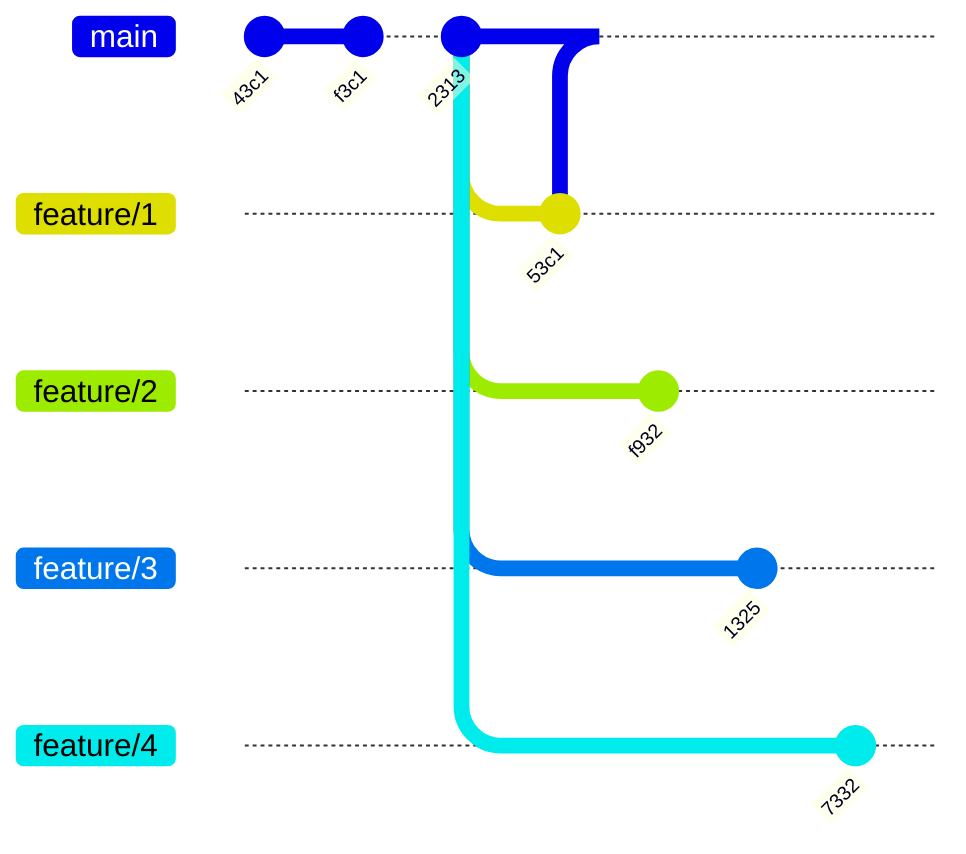

# 🌿 Git Branching - Multiple Branch

## 📚 Pengenalan Multiple Branch

### 🎯 Apa itu Multiple Branch?

**Multiple Branch** adalah kemampuan Git untuk mengelola banyak branch sekaligus dalam satu repository.

> 💡 **Fun Fact**: Dalam proyek nyata, kamu akan membuat puluhan bahkan ratusan branch!

### ✨ Mengapa Multiple Branch Penting?

- **Pada kenyataannya**, saat membuat aplikasi, branch biasanya akan dibuat **banyak sekali**
- **Git mendukung multiple branch**, artinya sebanyak apapun branch yang kita buat, Git bisa menanganinya dengan baik

### 🎨 Keuntungan Menggunakan Multiple Branch

- ✅ Setiap fitur dikembangkan secara **terpisah**
- ✅ Tidak mengganggu branch **master/main**
- ✅ Tim bisa bekerja **paralel** tanpa konflik
- ✅ Mudah untuk **review** dan **testing**

---

## 🎯 Tugas Praktik

### 📝 Instruksi Tugas

Sekarang saatnya **praktek**! Ikuti langkah-langkah berikut:

**Step 1: Buat 4 Branch**
- `feature/1` untuk fitur pertama
- `feature/2` untuk fitur kedua  
- `feature/3` untuk fitur ketiga
- `feature/4` untuk fitur keempat

**Step 2: Commit di Setiap Branch**

Lakukan commit untuk perubahan file di masing-masing branch:
- 📄 `feature/1` → untuk **file1.txt**
- 📄 `feature/2` → untuk **file2.txt**
- 📄 `feature/3` → untuk **file3.txt**
- 📄 `feature/4` → untuk **file4.txt**

> 🎓 **Tips Belajar**: Mulai dengan satu branch dulu, pahami prosesnya, baru lanjut ke branch berikutnya!

---

## 🗺️ Diagram Multiple Branch

### 📊 Visualisasi Branch

Berikut adalah gambaran bagaimana struktur branch kita akan terlihat:



### 🔍 Penjelasan Diagram

**Alur Kerja:**
1. **Branch Master** memiliki 4 commit: `43c1` → `f3c1` → `53c1` → `2313`
2. Dari commit `2313`, dibuat **4 branch berbeda**:
   - 🔵 `feature/1` dengan commit `53c1`
   - 🟢 `feature/2` dengan commit `f932`
   - 🟣 `feature/3` dengan commit `1325`
   - 🟤 `feature/4` dengan commit `7332`

> 💡 **Catatan Penting**: Setiap branch berkembang secara **independen** dari master branch!

---

## 🚀 Langkah-Langkah Praktek

### 1️⃣ Membuat Branch Baru

```bash
# Buat branch feature/1
git branch feature/1

# Buat branch feature/2
git branch feature/2

# Buat branch feature/3
git branch feature/3

# Buat branch feature/4
git branch feature/4
```

### 2️⃣ Pindah ke Branch dan Commit

```bash
# Contoh untuk feature/1
git checkout feature/1
echo "Fitur 1" > file1.txt
git add file1.txt
git commit -m "Menambahkan file1.txt"
```

> 🎯 **Challenge**: Ulangi langkah di atas untuk `feature/2`, `feature/3`, dan `feature/4`!

### 3️⃣ Cek Semua Branch

```bash
# Lihat daftar semua branch
git branch

# Lihat branch dengan detail
git branch -v
```

---

## ✅ Checklist Pembelajaran

Tandai ✅ jika kamu sudah paham:

- [ ] Memahami konsep multiple branch
- [ ] Bisa membuat branch baru
- [ ] Bisa berpindah antar branch
- [ ] Bisa melakukan commit di branch berbeda
- [ ] Memahami diagram branch

---

## 💪 Tips untuk Pemula

1. **🐢 Pelan-pelan saja**: Pahami satu branch dulu sebelum lanjut
2. **📝 Catat**: Tulis command yang sering dipakai
3. **🔄 Praktek**: Ulangi sampai terbiasa
4. **❓ Tanya**: Jangan malu bertanya jika bingung
5. **🎯 Fokus**: Selesaikan satu fitur dalam satu branch

---

## 🎉 Selamat Belajar!

Kamu sudah mempelajari konsep **Multiple Branch** di Git! 

**Next Steps:**
- ⏭️ Pelajari cara **merge** branch
- ⏭️ Pelajari cara **mengatasi conflict**
- ⏭️ Pelajari **best practices** branching

> 💪 **Keep Learning**: Practice makes perfect!
