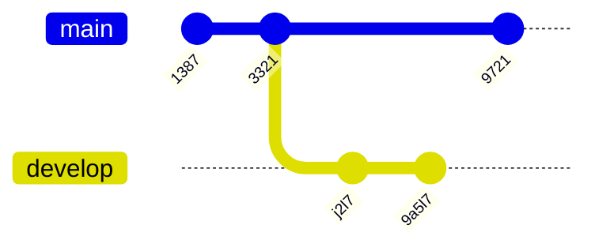
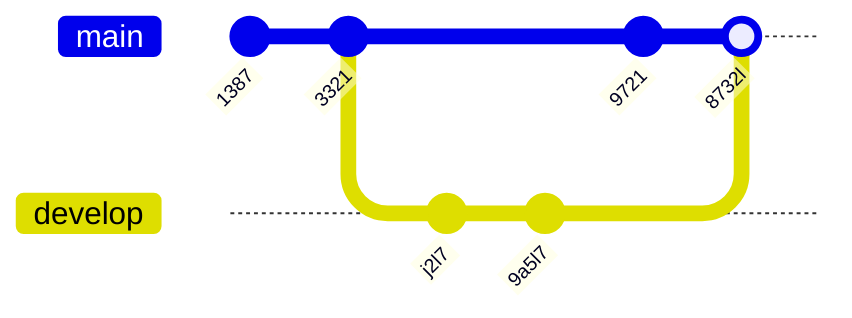
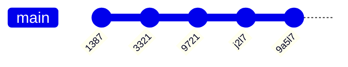

# 🔄 Git Rebase - Panduan Lengkap untuk Pemula

## 📚 Pengenalan Rebase

Sebelumnya untuk menggabungkan dua buah branch, kita sudah belajar yang namanya **merge**. Sekarang kita akan bahas tentang cara lain menggabungkan dua buah branch, yaitu **rebase**.

> ⚠️ **Catatan:** Rebase agak sedikit kompleks, jadi kita akan coba bahas secara visual agar lebih mudah dipahami.

---

## 🎯 Diagram Branch Awal

Sebelum kita melakukan rebase, mari kita lihat seperti apa kondisi branch kita saat ini:



**Penjelasan:**
- 🔵 **Branch main** (merah): Memiliki commit `1387`, `3321`, dan `9721`
- 🟢 **Branch develop** (hijau): Bercabang dari commit `3321`, memiliki commit `j2l7` dan `9a5l7`
- 📍 Branch develop dan main berkembang secara paralel

---

## 🔀 Diagram Merge Branch

Ini adalah cara menggabungkan branch menggunakan **merge** yang sudah kita pelajari sebelumnya:



**Penjelasan:**
- ✅ Branch develop di-**merge** ke branch main
- 🔗 Terbentuk **merge commit** `8732l`
- 📊 History menunjukkan percabangan (branching) yang jelas
- 💡 Dengan merge, kita bisa melihat kapan branch dibuat dan digabungkan

---

## 🎨 Diagram Rebase Branch

Sekarang mari kita lihat hasil menggunakan **rebase**:



**Penjelasan:**
- ✨ Commit dari branch develop dipindahkan ke ujung branch main
- 📏 History menjadi **linear** (lurus), tidak ada percabangan
- 🔄 Commit `j2l7` dan `9a5l7` sekarang berada setelah commit `9721`
- 🎯 Hasilnya terlihat seperti semua perubahan dilakukan secara berurutan

---

## 📝 Tugas Praktik 1 - Membuat Branch dan Commit

Mari kita praktik membuat kondisi seperti diagram di atas:

**Langkah-langkah:**
1. 📂 Di branch utama, buat branch `feature/rebase`
   ```bash
   git checkout -b feature/rebase
   ```

2. ✏️ Di branch utama (pindah dulu ke main), ubah `file1.txt` lalu commit
   ```bash
   git checkout main
   echo "perubahan di main" >> file1.txt
   git add file1.txt
   git commit -m "ubah file1 di main"
   ```

3. 🔀 Pindah ke branch `feature/rebase`
   ```bash
   git checkout feature/rebase
   ```

4. 📝 Di branch `feature/rebase`, ubah `file2.txt` lalu commit
   ```bash
   echo "perubahan di feature" >> file2.txt
   git add file2.txt
   git commit -m "ubah file2 di feature"
   ```

5. ✏️ Di branch `feature/rebase`, ubah `file3.txt` lalu commit
   ```bash
   echo "perubahan lagi di feature" >> file3.txt
   git add file3.txt
   git commit -m "ubah file3 di feature"
   ```

> 💡 **Tips:** Setelah langkah ini, branch main dan feature/rebase sudah berkembang secara paralel!

---

## 🚀 Melakukan Rebase

### 📖 Pengertian

**Rebase** adalah proses memindahkan atau menggabungkan serangkaian commit ke base commit yang baru.

### ⌨️ Perintah Dasar

Untuk melakukan rebase, gunakan perintah:

```bash
git rebase namabranch
```

### 🎯 Contoh Penggunaan

Jika sekarang kita ada di branch `feature/rebase`, lalu menggunakan perintah:

```bash
git rebase master
```

**Artinya:**
- 🔄 Kita melakukan rebase semua commit di **master** ke branch **develop**
- 📍 Base dari branch develop akan dipindahkan ke ujung branch master
- ✨ Commit di develop akan diterapkan ulang di atas commit terakhir master

### 🎬 Proses yang Terjadi

1. 📦 Git menyimpan sementara semua commit di branch develop
2. 🔄 Git memindahkan pointer develop ke ujung branch master
3. ✍️ Git menerapkan kembali commit-commit yang disimpan tadi satu per satu
4. 🆕 Setiap commit mendapatkan ID baru

---

## 📝 Tugas Praktik 2 - Melakukan Rebase

Sekarang saatnya praktik rebase!

**Langkah-langkah:**

1. 🔀 Pindah ke branch `feature/rebase`
   ```bash
   git checkout feature/rebase
   ```

2. 🚀 Lakukan rebase dengan branch master
   ```bash
   git rebase master
   ```

3. ✅ Jika tidak ada konflik, rebase akan berhasil
4. ⚠️ Jika ada konflik, selesaikan konflik lalu lanjutkan dengan:
   ```bash
   git add .
   git rebase --continue
   ```

> 💡 **Catatan Penting:** Setelah rebase, commit history di branch feature/rebase akan berubah!

---

## 🔗 Merge Branch Setelah Rebase

### ❓ Mengapa Perlu Merge Lagi?

Setelah melakukan rebase, bukan berarti branch yang di-rebase sekarang posisinya ada di branch yang melakukan rebase. Posisinya tetap ada di commit terakhir di branch tersebut.

**Seperti yang terlihat pada gambar Diagram Rebase Branch:**
- 📍 Branch develop masih menunjuk ke commit terakhirnya
- 🎯 Branch main belum "tahu" tentang commit dari develop

### 🎯 Solusinya

Agar posisinya sama dengan branch yang melakukan rebase, kita bisa menggunakan perintah **merge**:

```bash
git checkout main
git merge feature/rebase
```

**Yang Terjadi:**
- ⚡ Ini akan menjadi **fast-forward merge**
- 📏 Tidak ada merge commit tambahan
- ✨ Branch main akan menunjuk ke commit terakhir

---

## 🎨 Diagram Setelah Merge

Setelah melakukan merge, hasilnya akan seperti ini:


**Penjelasan:**
- ✅ Semua commit sekarang dalam satu garis lurus
- 🎯 Branch main dan develop menunjuk ke commit yang sama
- 📏 History terlihat sangat **bersih dan linear**
- 🚀 Tidak ada merge commit yang terlihat

---

## ⚖️ Merge vs Rebase

### 🟢 Kelebihan Rebase

- ✨ Timeline terlihat sangat **rapih dan bersih**
- 📏 History menjadi **linear** (garis lurus)
- 🎯 Mudah dibaca dan dipahami
- 🚀 Tidak ada merge commit yang "berantakan"

### 🔴 Kekurangan Rebase

- ⚠️ **Commit ID berubah!** Rebase menulis ulang semua commit
- 🔗 Semua referensi ke commit ID lama akan **rusak dan hilang**
- 📚 History asli yang menunjukkan kapan branch dibuat menjadi hilang
- 🚫 **Berbahaya** jika dilakukan di branch yang sudah dipush dan digunakan orang lain

### 🟢 Kelebihan Merge

- 📚 History **tetap utuh**, menunjukkan kapan branch dibuat
- 🔗 Commit ID **tidak berubah**
- 👥 **Aman** untuk branch yang sudah dipush
- 📊 Mudah tracking siapa yang merge dan kapan

### 🔴 Kekurangan Merge

- 📊 History bisa terlihat **berantakan** dengan banyak merge commit
- 🔀 Percabangan bisa membingungkan untuk project besar
- 📈 Graph commit terlihat lebih kompleks

---

## 🎯 Kapan Menggunakan Rebase?

### ✅ Gunakan Rebase Ketika:

- 🔧 Bekerja di **branch lokal** yang belum di-push
- 🧹 Ingin **membersihkan** history sebelum merge ke branch utama
- 📏 Ingin history yang **linear dan mudah dibaca**
- 👤 Bekerja **sendirian** di branch tersebut

### ❌ Jangan Gunakan Rebase Ketika:

- 👥 Branch sudah **dipush** dan digunakan orang lain
- 📚 Ingin **mempertahankan** history asli
- 🔄 Branch adalah branch **publik** (seperti main, develop)
- ⚠️ Tidak yakin apa yang sedang dilakukan

---

## 💡 Tips dan Best Practices

1. **🔒 Golden Rule:** Jangan pernah rebase branch publik yang sudah digunakan orang lain!

2. **🧪 Praktik di Branch Lokal:** Selalu coba rebase di branch lokal dulu sebelum push

3. **💾 Backup Branch:** Buat backup branch sebelum rebase:
   ```bash
   git branch backup-feature
   ```

4. **📖 Pelajari Konflik:** Pahami cara menyelesaikan konflik saat rebase

5. **🔄 Rebase Interaktif:** Gunakan `git rebase -i` untuk mengedit commit history:
   ```bash
   git rebase -i HEAD~3
   ```

6. **⚡ Kombinasi:** Gunakan rebase untuk branch pribadi, merge untuk integrasi ke branch utama

---

## 🎓 Kesimpulan

- 🔄 **Rebase** adalah cara alternatif untuk menggabungkan branch
- 📏 Menghasilkan history yang **linear dan bersih**
- ⚠️ **Mengubah commit ID**, jadi hati-hati penggunaannya
- 🎯 Tidak ada yang lebih baik antara merge dan rebase, **semua tergantung kebutuhan**
- 💡 Gunakan rebase untuk membersihkan history lokal, merge untuk kolaborasi

> 🌟 **Ingat:** Practice makes perfect! Terus berlatih dan jangan takut mencoba!

---

## 📚 Referensi Lanjutan

Untuk memperdalam pemahaman, pelajari juga:
- 🔀 Interactive Rebase (`git rebase -i`)
- 🔙 Undo Rebase (`git reflog`)
- 🌿 Git Workflow best practices
- 👥 Team collaboration strategies

**Selamat belajar! 🚀**
