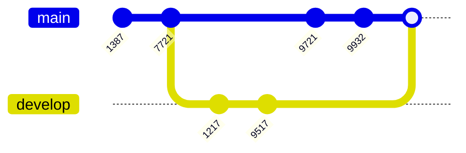
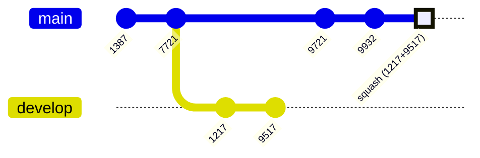

# 🎯 Squash di Git

## 📚 Apa itu Squash?

**Squash** adalah teknik untuk menggabungkan beberapa commit menjadi satu commit saja. Bayangkan kamu punya 10 commit kecil-kecil, dengan squash kamu bisa jadikan semua itu menjadi 1 commit yang rapi!

### 🤔 Mengapa Perlu Squash?

Ketika kita bekerja di branch terpisah, kita sering membuat banyak commit kecil seperti:
- ✅ "fix typo"
- ✅ "update styling"
- ✅ "fix bug lagi"
- ✅ "masih fix bug"
- ✅ dan seterusnya...

Kalau semua commit ini masuk ke branch utama (main/master), history-nya jadi berantakan dan sulit dibaca! 😵

---

## 🔄 Cara Kerja Squash

### Tanpa Squash (Merge Biasa)
> ⚠️ Saat kita melakukan **merge** atau **rebase** biasa, semua commit history akan tetap ada

Misalnya:
- Di branch tersebut ada **10 commit**
- Ketika di-merge → **10 commit itu semua akan tetap ada** di branch utama

### Dengan Squash
> ✨ Squash akan mengubah banyak commit menjadi **1 commit saja**

Misalnya:
- Di branch tersebut ada **10 commit**
- Ketika di-merge dengan squash → **10 perubahan digabung menjadi 1 commit**

**Hasilnya?** History jadi lebih bersih dan mudah dibaca! 🎉

---

## 📊 Diagram Merge Tanpa Squash

Perhatikan diagram berikut, semua commit dari branch `develop` tetap terlihat ketika di-merge:



> 👀 **Lihat:** Commit `1217` dan `9517` dari branch develop tetap muncul setelah merge

---

## ✨ Diagram Merge Menggunakan Squash

Sekarang perhatikan dengan squash, commit dari branch `develop` digabung jadi satu:



> ✅ **Lihat:** Commit `1217` dan `9517` sudah digabung menjadi satu commit dengan nama "squash (1217+9517)"

---

## 💻 Cara Melakukan Squash

### 📝 Perintah Dasar

Squash bisa dilakukan dengan dua cara:
1. 🔀 Ketika **merge**
2. 🔄 Ketika **rebase**

### Squash saat Merge

Untuk melakukan squash ketika merge, gunakan perintah:

```bash
git merge --squash namabranch
```

**Penjelasan:**
- `git merge` → perintah untuk menggabungkan branch
- `--squash` → opsi untuk menggabungkan semua commit jadi satu
- `namabranch` → nama branch yang ingin di-merge

**Contoh penggunaan:**

```bash
# Pastikan kamu di branch main/master
git checkout main

# Merge branch feature dengan squash
git merge --squash feature/login-page

# Commit hasil squash
git commit -m "Add login page feature"
```

> 💡 **Tips:** Setelah squash, jangan lupa untuk membuat commit baru dengan pesan yang jelas dan deskriptif!

---

## 🎯 Tugas Praktik

Mari kita praktikkan squash dengan langkah-langkah berikut:

### Langkah 1️⃣: Buat Branch Baru
```bash
# Pastikan kamu di branch master
git checkout master

# Buat branch baru bernama feature/merge-squash
git checkout -b feature/merge-squash
```

### Langkah 2️⃣: Buat Perubahan di Branch Master
```bash
# Pindah ke branch master
git checkout master

# Edit file version.txt (buat file baru jika belum ada)
echo "version 1.0.0" > version.txt

# Commit perubahan
git add version.txt
git commit -m "Update version to 1.0.0"
```

### Langkah 3️⃣: Buat Commit di Branch Feature
```bash
# Pindah ke branch feature/merge-squash
git checkout feature/merge-squash

# Buat file1.txt
echo "Ini adalah file 1" > file1.txt
git add file1.txt
git commit -m "Add file 1"

# Buat file2.txt
echo "Ini adalah file 2" > file2.txt
git add file2.txt
git commit -m "Add file 2"
```

### Langkah 4️⃣: Merge dengan Squash
```bash
# Pindah ke branch master
git checkout master

# Merge branch feature/merge-squash dengan squash
git merge --squash feature/merge-squash

# Commit hasil squash dengan pesan yang jelas
git commit -m "Add file 1 and file 2"
```

### Langkah 5️⃣: Cek Hasilnya
```bash
# Lihat log untuk melihat hasil squash
git log --oneline

# Kamu akan melihat hanya 1 commit untuk file 1 dan file 2
# bukan 2 commit terpisah!
```

---

## 🎓 Kesimpulan

### ✅ Yang Perlu Diingat:

- **Squash** = menggabungkan banyak commit menjadi satu
- Membuat **history lebih rapi** dan mudah dibaca
- Berguna saat merge atau rebase
- Gunakan `git merge --squash namabranch` untuk squash saat merge
- **Jangan lupa commit** setelah melakukan squash!

### 🌟 Kapan Menggunakan Squash?

- ✅ Ketika punya banyak commit kecil-kecil yang tidak penting
- ✅ Ketika ingin membuat history lebih bersih
- ✅ Sebelum merge feature branch ke main/master
- ❌ Jangan squash jika setiap commit punya makna penting tersendiri

---

## 🚀 Tips Pro

> 💡 **Best Practice:** Selalu buat commit message yang jelas setelah squash. Jelaskan apa saja yang berubah dalam commit hasil squash tersebut.

> ⚠️ **Perhatian:** Setelah squash, commit-commit lama tidak akan hilang di branch asalnya. Squash hanya mempengaruhi hasil merge-nya saja.

---

**Selamat belajar! 🎉** Terus berlatih sampai nyaman menggunakan squash ya!
