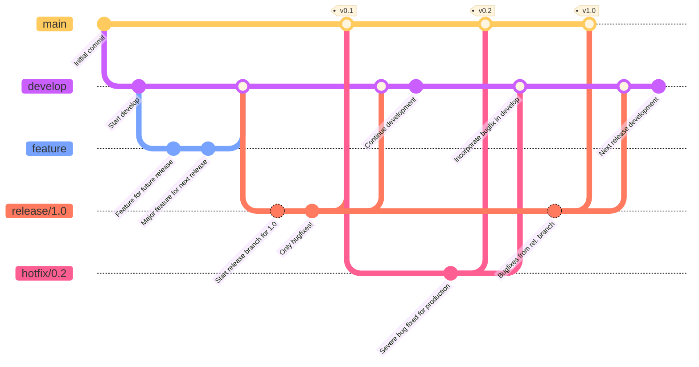

# 🌊 Gitflow Workflow

> **📖 Strategi Git Branching yang Paling Populer dan Terstruktur**

## 🎯 Apa itu Gitflow?

**Gitflow** adalah strategi git branching yang paling tua dan paling banyak diadopsi oleh tim-tim software development di seluruh dunia.

- 📅 **Diciptakan:** Tahun 2010 oleh Vincent Driessen
- 🔗 **Referensi:** https://nvie.com/posts/a-successful-git-branching-model/
- ⭐ **Kelebihan:** Sangat terstruktur dan cocok untuk software dengan versioning jelas

---

## ⚠️ Catatan Penting dari Pencipta (2020)

> 💡 **Vincent Driessen Update (March 2020):**
> 
> Gitflow diciptakan 10 tahun yang lalu, ketika Git masih baru. Model ini menjadi sangat populer, namun **tidak cocok untuk semua jenis project**!

### 🎯 Kapan Menggunakan Gitflow?

✅ **COCOK untuk:**
- Software dengan **multiple versions** yang berjalan bersamaan
- Aplikasi yang perlu **explicit versioning** (contoh: v1.0, v2.0)
- Project yang **tidak continuous delivery**
- Software desktop/mobile yang di-release secara berkala

❌ **TIDAK COCOK untuk:**
- Web apps dengan **continuous delivery**
- Software yang **tidak perlu rollback**
- Project yang hanya punya **satu versi production**
- Tim kecil yang butuh workflow simple

> 🎓 **Tip untuk Pemula:** Jika projectmu adalah web app modern yang deploy terus-menerus, pertimbangkan workflow yang lebih simple seperti GitHub Flow atau Trunk Based Development.

---

## 🗺️ Visualisasi Gitflow



---

---

## 🌳 Struktur Branch di Gitflow

Gitflow menggunakan **5 jenis branch** dengan peran yang sangat jelas:

### 1️⃣ **Main Branches** (Branch Utama - Permanent)

#### 🔴 **Master/Main Branch**
- 🎯 **Tujuan:** Menyimpan kode production yang sudah stable
- 📦 **Isi:** Hanya kode yang sudah siap release
- 🏷️ **Tag:** Setiap commit di master = release baru (v1.0, v1.1, dll)
- ⚠️ **Aturan:** JANGAN commit langsung ke master!

#### 🟢 **Develop Branch**
- 🎯 **Tujuan:** Branch utama untuk development
- 📦 **Isi:** Kode terbaru untuk release berikutnya
- 🔄 **Sifat:** Integration branch - tempat feature-feature digabung
- 💡 **Analogi:** Ini seperti "staging area" sebelum ke production

---

### 2️⃣ **Supporting Branches** (Branch Pendukung - Temporary)

#### 🟣 **Feature Branches**

Branch untuk mengembangkan fitur baru.

**📋 Karakteristik:**
- **Berasal dari:** `develop`
- **Merge ke:** `develop`
- **Penamaan:** `feature/nama-fitur` atau `feature/login-system`
- **Lifetime:** Selama fitur dikembangkan
- **Lokasi:** Biasanya hanya di local repo developer

**💡 Kapan Digunakan:**
- Membuat fitur baru untuk release mendatang
- Eksperimen fitur yang mungkin tidak jadi dipakai
- Development yang memakan waktu lama

---

#### 🔵 **Release Branches**

Branch untuk persiapan release baru.

**📋 Karakteristik:**
- **Berasal dari:** `develop`
- **Merge ke:** `develop` DAN `master`
- **Penamaan:** `release/1.2` atau `release/v2.0`
- **Lifetime:** Selama proses persiapan release
- **Isi:** Hanya bugfix kecil dan metadata (nomor versi, tanggal build)

**💡 Kapan Digunakan:**
- Develop sudah siap untuk release
- Perlu finalisasi sebelum production
- Testing tahap akhir
- Update version number dan dokumentasi

**⚠️ Aturan Penting:**
- ❌ DILARANG menambah fitur besar
- ✅ HANYA bugfix minor dan persiapan release

---

#### 🔴 **Hotfix Branches**

Branch untuk fix bug critical di production.

**📋 Karakteristik:**
- **Berasal dari:** `master`
- **Merge ke:** `develop` DAN `master`
- **Penamaan:** `hotfix/1.2.1` atau `hotfix/critical-bug`
- **Lifetime:** Sampai bug selesai di-fix
- **Urgency:** 🚨 Emergency fix!

**💡 Kapan Digunakan:**
- Ada bug critical di production yang harus segera diperbaiki
- Tidak bisa menunggu release cycle berikutnya
- Production sedang bermasalah

**🎯 Keuntungan:**
- Tim lain bisa tetap develop di `develop` branch
- Fix langsung ke production tanpa mengganggu development

---

## 🚀 Workflow Gitflow Step-by-Step

### 📝 Scenario 1: Membuat Fitur Baru

**Step 1: Buat Feature Branch**
```bash
# Pindah ke develop
git checkout develop

# Buat branch baru untuk fitur
git checkout -b feature/login-system
```

**Output:**
```
Switched to a new branch 'feature/login-system'
```

**Step 2: Develop Fitur**
```bash
# Coding... coding... coding...

# Commit perubahan
git add .
git commit -m "Add login form"
git commit -m "Add authentication logic"
```

**Step 3: Merge ke Develop**
```bash
# Pindah ke develop
git checkout develop

# Merge dengan --no-ff (penting!)
git merge --no-ff feature/login-system
```

**Output:**
```
Updating ea1b82a..05e9557
(Summary of changes)
```

**Step 4: Hapus Feature Branch**
```bash
git branch -d feature/login-system
```

**Output:**
```
Deleted branch feature/login-system (was 05e9557)
```

> 💡 **Kenapa pakai `--no-ff`?**
> - Flag `--no-ff` (no fast-forward) membuat commit merge baru
> - Mudah melacak history fitur di log Git
> - Memudahkan rollback jika fitur bermasalah

---

### 📦 Scenario 2: Membuat Release

**Step 1: Buat Release Branch**
```bash
# Misalnya develop sudah siap untuk release 1.2
git checkout -b release/1.2 develop
```

**Output:**
```
Switched to a new branch 'release/1.2'
```

**Step 2: Update Version Number**
```bash
# Update version di package.json, README, dll
./bump-version.sh 1.2

git commit -a -m "Bumped version number to 1.2"
```

**Output:**
```
[release/1.2 74d9424] Bumped version number to 1.2
1 files changed, 1 insertions(+), 1 deletions(-)
```

**Step 3: Testing & Bugfix**
```bash
# Lakukan testing
# Fix bug kalau ada
git commit -m "Fix minor bug in login"
```

**Step 4: Merge ke Master (Production)**
```bash
git checkout master
git merge --no-ff release/1.2
git tag -a v1.2 -m "Release version 1.2"
```

**Output:**
```
Merge made by recursive.
(Summary of changes)
```

**Step 5: Merge Kembali ke Develop**
```bash
git checkout develop
git merge --no-ff release/1.2
```

**Step 6: Hapus Release Branch**
```bash
git branch -d release/1.2
```

**Output:**
```
Deleted branch release/1.2 (was ff452fe)
```

---

### 🚨 Scenario 3: Hotfix Production Bug

**Step 1: Buat Hotfix Branch dari Master**
```bash
# Production version 1.2 ada bug critical!
git checkout -b hotfix/1.2.1 master
```

**Output:**
```
Switched to a new branch 'hotfix/1.2.1'
```

**Step 2: Bump Version**
```bash
./bump-version.sh 1.2.1
git commit -a -m "Bumped version number to 1.2.1"
```

**Output:**
```
[hotfix/1.2.1 41e61bb] Bumped version number to 1.2.1
1 files changed, 1 insertions(+), 1 deletions(-)
```

**Step 3: Fix Bug**
```bash
# Fix the critical bug
git commit -m "Fixed severe production problem"
```

**Output:**
```
[hotfix/1.2.1 abbe5d6] Fixed severe production problem
5 files changed, 32 insertions(+), 17 deletions(-)
```

**Step 4: Merge ke Master**
```bash
git checkout master
git merge --no-ff hotfix/1.2.1
git tag -a v1.2.1 -m "Hotfix version 1.2.1"
```

**Step 5: Merge ke Develop**
```bash
git checkout develop
git merge --no-ff hotfix/1.2.1
```

**Step 6: Hapus Hotfix Branch**
```bash
git branch -d hotfix/1.2.1
```

**Output:**
```
Deleted branch hotfix/1.2.1 (was abbe5d6)
```

---

## ✅ Keuntungan Gitflow

| Keuntungan | Penjelasan |
|------------|------------|
| 🎯 **Terstruktur** | Setiap branch punya peran jelas |
| 👥 **Paralel Development** | Tim bisa kerja di fitur berbeda tanpa conflict |
| 🏷️ **Clear Versioning** | Mudah tracking version dengan tag |
| 🚨 **Emergency Fix** | Hotfix tidak ganggu development |
| 📊 **History Jelas** | Mudah lihat kapan fitur masuk dan release dibuat |

---

## ❌ Kekurangan Gitflow

| Kekurangan | Penjelasan |
|------------|------------|
| 🔄 **Kompleks** | Terlalu banyak branch untuk project simple |
| ⏰ **Lambat** | Tidak cocok untuk continuous deployment |
| 📚 **Learning Curve** | Butuh waktu untuk tim baru memahami |
| 🔀 **Banyak Merge** | Merge conflicts lebih sering terjadi |

---

## 🎓 Best Practices

### ✨ DO (Lakukan)

- ✅ Selalu gunakan `--no-ff` saat merge
- ✅ Tag setiap release di master
- ✅ Hapus branch setelah di-merge
- ✅ Commit message yang jelas dan deskriptif
- ✅ Testing sebelum merge ke develop atau master
- ✅ Code review sebelum merge

### ❌ DON'T (Jangan)

- ❌ Commit langsung ke master atau develop
- ❌ Menambah fitur besar di release branch
- ❌ Merge tanpa testing
- ❌ Lupa merge hotfix ke develop
- ❌ Membiarkan feature branch terlalu lama

---

## 🆚 Gitflow vs Workflow Lain

| Aspek | Gitflow | GitHub Flow | Trunk Based |
|-------|---------|-------------|-------------|
| **Kompleksitas** | 🔴 Tinggi | 🟢 Rendah | 🟡 Sedang |
| **Branch Count** | 5+ types | 2 types | 1-2 types |
| **Release Cycle** | Scheduled | Continuous | Continuous |
| **Best For** | Versioned software | Web apps | Large teams |
| **Learning Curve** | 🔴 Steep | 🟢 Easy | 🟡 Medium |

---

## 📚 Kesimpulan

**Gitflow adalah pilihan tepat jika:**
- 🎯 Project memerlukan **multiple versions**
- 📦 Release dilakukan secara **scheduled/berkala**
- 👥 Tim **cukup besar** dan terorganisir
- 🏷️ Perlu **explicit versioning** (v1.0, v2.0, dll)

**Pertimbangkan workflow lain jika:**
- 🚀 Project adalah **web app** dengan continuous deployment
- ⚡ Butuh workflow yang **lebih cepat dan simple**
- 👤 Tim **kecil** atau project **personal**
- 🔄 Deploy dilakukan **berkali-kali sehari**

---

## 🔗 Referensi

- **Original Article:** [A Successful Git Branching Model](https://nvie.com/posts/a-successful-git-branching-model/)
- **Author:** Vincent Driessen
- **License:** Creative Commons BY-SA
- **Year:** 2010

---

> 💡 **Tips Akhir untuk Pemula:**
> 
> Jangan overwhelmed dengan kompleksitas Gitflow! Mulai dengan memahami **2 main branches** (master & develop) dulu, baru pelajari supporting branches satu per satu. Practice makes perfect! 🚀
