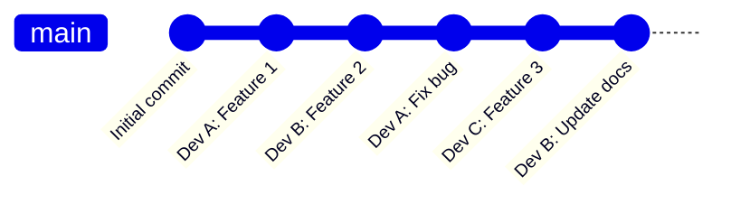
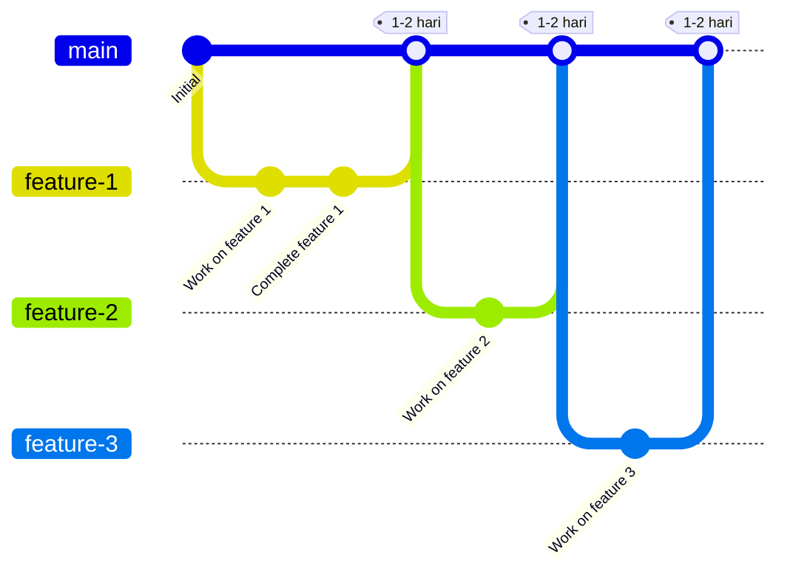
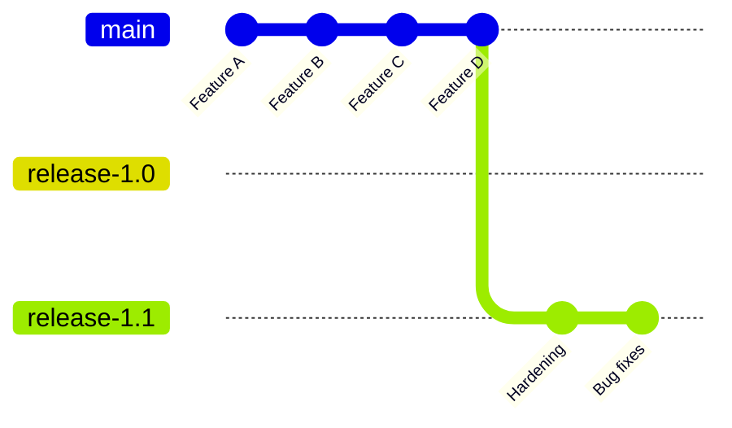
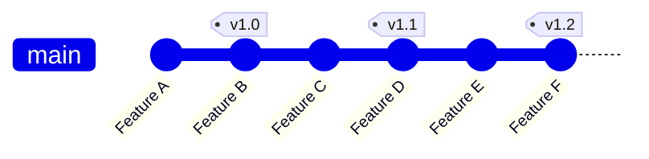
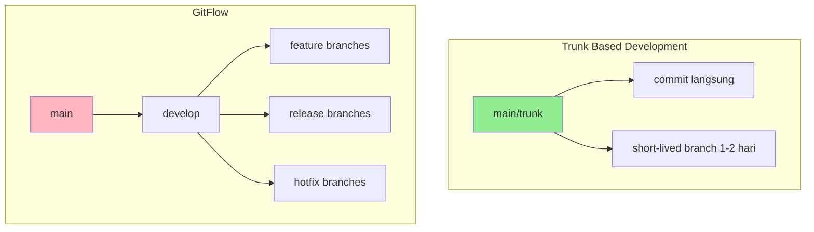
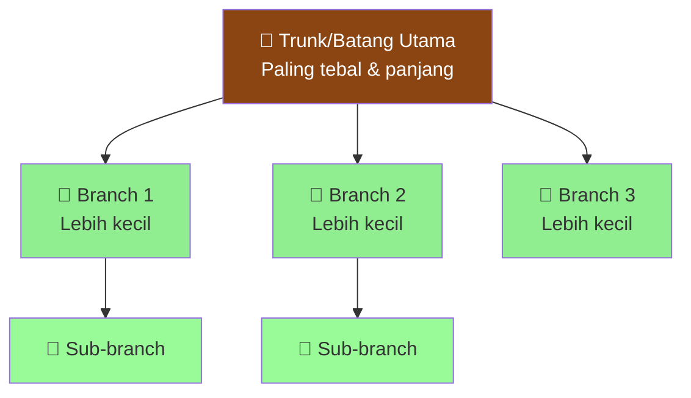
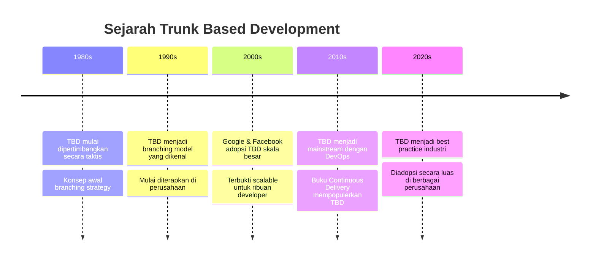
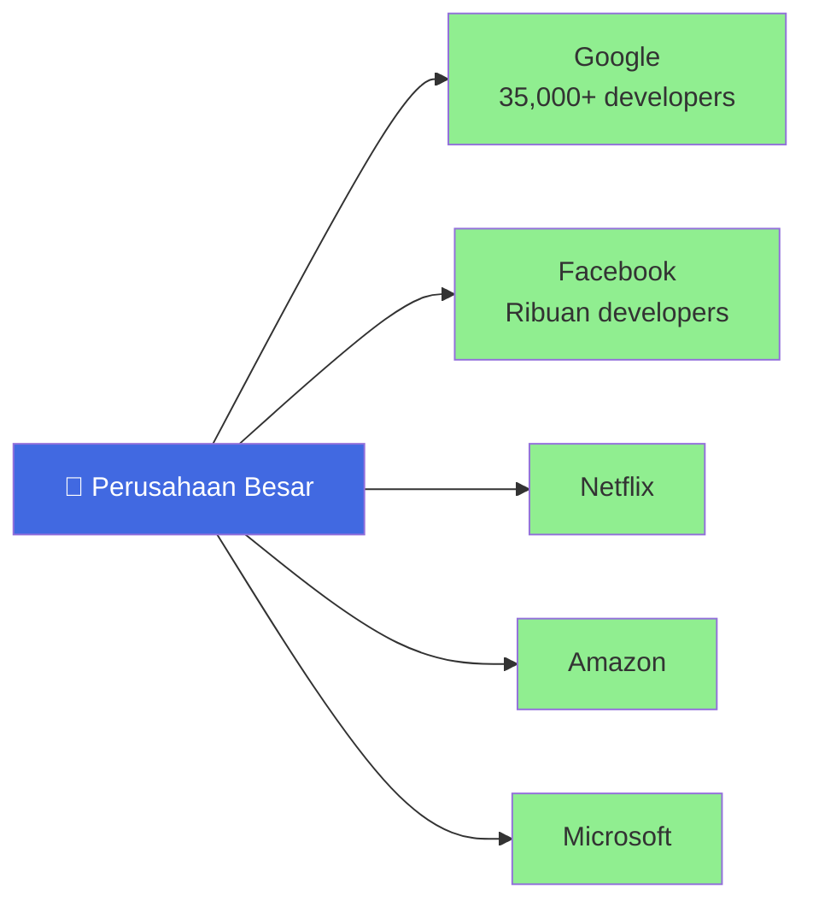

# 🌳 Trunk Based Development

> **Ringkasan Singkat:** Model branching di source control dimana developer berkolaborasi pada satu branch utama yang disebut 'trunk' (atau 'main'), menghindari pembuatan branch development jangka panjang lainnya.

---

## 📚 Daftar Isi

- [Pengenalan](#pengenalan)
- [Mengapa Trunk Based Development?](#mengapa-trunk-based-development)
- [Cara Kerja TBD](#cara-kerja-tbd)
- [Keuntungan TBD](#keuntungan-tbd)
- [Klaim dan Keunggulan](#klaim-dan-keunggulan)
- [Hal Penting yang Perlu Diperhatikan](#hal-penting-yang-perlu-diperhatikan)
- [Sejarah TBD](#sejarah-tbd)

---

## 🎯 Pengenalan

**Trunk Based Development (TBD)** adalah strategi git branching yang saat ini sedang populer di kalangan developer profesional.

### ✨ Karakteristik Utama:

- Developer bekerja pada **satu branch utama** yang disebut `trunk` atau `main`
- Menghindari branch development jangka panjang
- Fokus pada **kesederhanaan** dan **kecepatan delivery**
- Menghindari "merge hell" (konflik merge yang rumit)
- Build tidak akan rusak (broken)

> 💡 **Catatan:** Istilah `main` digunakan oleh komunitas Git sejak 2020, sebelumnya dikenal dengan `master`

### 📖 Referensi Lengkap:
- https://trunkbaseddevelopment.com/

---

## 🤔 Mengapa Trunk Based Development?

### ❌ Masalah dengan Branch Banyak:

Ketika kita membuat **banyak branch jangka panjang** yang terpisah dari branch utama, beberapa masalah akan muncul:

- **Konflik merge** yang rumit dan memakan waktu
- Sulit melacak perubahan kode
- Proses integrasi menjadi lambat
- Tim kehilangan sinkronisasi

### ✅ Solusi TBD:

Dengan TBD, semua orang bekerja di branch yang sama, sehingga:

- Integrasi kode menjadi **lebih mudah**
- Konflik terdeteksi **lebih cepat**
- Delivery menjadi **lebih cepat**
- Tim selalu **tersinkronisasi**

---

## 🛠️ Cara Kerja TBD

### 1️⃣ Untuk Tim Kecil (Small Teams)

**Penjelasan:**
- Developer langsung commit ke branch `main`
- Tidak ada branch terpisah
- Cocok untuk tim 2-5 orang
- Commit dilakukan beberapa kali sehari

### 2️⃣ Untuk Tim Besar (Scaled Teams)

**Penjelasan:**
- Menggunakan **short-lived feature branch** (branch berumur pendek)
- Branch hanya hidup **1-2 hari** maksimal
- Setelah code review selesai, langsung merge ke `main`
- Cocok untuk tim lebih dari 5 orang

---

## 🎁 Keuntungan TBD

### 1. 🔄 Continuous Integration (CI)

TBD adalah kunci utama untuk CI yang sukses:

- Developer commit ke trunk **minimal 1x dalam 24 jam**
- Setiap commit di-test secara otomatis
- Codebase selalu dalam kondisi **siap release**

### 2. 🚀 Continuous Delivery (CD)

Dengan TBD, Continuous Delivery menjadi mudah:

- Kode selalu siap untuk di-deploy
- Release bisa dilakukan **kapan saja**
- Mengurangi risiko deployment

### 3. 👥 Kolaborasi Tim Lebih Baik

- Semua developer bekerja di tempat yang sama
- Lebih mudah melihat pekerjaan orang lain
- Konflik terdeteksi lebih awal

### 4. ⚡ Delivery Lebih Cepat

- Tidak ada waktu terbuang untuk merge branch besar
- Feature bisa dirilis lebih cepat
- Feedback dari user lebih cepat didapat

---

## 📋 Klaim dan Keunggulan

### ✅ Yang Harus Dilakukan:

1. **Pilih TBD daripada GitFlow**
   - GitFlow menggunakan banyak branch jangka panjang
   - TBD lebih sederhana dan efisien

2. **Gunakan Pull Request (PR) untuk Code Review**
   - Feature branch hanya hidup **sangat singkat**
   - Branch dibuat oleh **satu developer** saja
   - Bisa dikerjakan solo, pair programming, atau mob programming

3. **Commit/Push Langsung ke Trunk** (untuk tim sangat kecil)
   - Tanpa feature branch
   - Langsung commit ke `main`

### 🛡️ Teknik Pendukung:

- **Feature Flags:** Menyembunyikan fitur yang belum selesai
- **Branch by Abstraction:** Teknik refactoring untuk perubahan besar
- **"Don't Break the Build":** Jangan sampai merusak build yang sudah ada

### 💻 Interpretasi "Dev Workstation":

Development bisa dilakukan di:
- Virtual Machine (VM)
- Dev Container (Docker)
- Local machine
- Cloud development environment

---

## ⚠️ Hal Penting yang Perlu Diperhatikan

### 1. 🔍 Short-lived Feature Branches

**Kapan digunakan:**
- Untuk code review sebelum merge
- Untuk CI/CD checking
- **Bukan** untuk membuat artifact atau publikasi

**Aturan penting:**
- Branch **hanya hidup 1-2 hari**
- Setelah review selesai, **langsung merge**
- Tim sangat kecil bisa commit langsung tanpa branch

### 2. 🎯 Release Branches

Ada dua strategi release:

#### **Strategi A: Release Branch**

**Penjelasan:**
- Branch release dipotong dari trunk **just-in-time**
- Di-"hardening" sebelum release
- Dihapus setelah beberapa waktu release

#### **Strategi B: Release dari Trunk**

**Penjelasan:**
- Langsung release dari `main`
- Menggunakan strategi **"fix forward"** untuk bug
- Cocok untuk tim dengan throughput tinggi

### 3. 🎭 Teknik Pendukung TBD

**Branch by Abstraction:**
- Untuk perubahan yang memakan waktu lama
- Membuat abstraction layer saat refactoring

**Feature Flags:**
- Menyembunyikan fitur yang belum selesai
- Kontrol release fitur dengan lebih fleksibel
- Memungkinkan **concurrent development** untuk beberapa release

### 4. 🤖 Build Server

**Wajib untuk tim > 2 developer:**

- Verifikasi setiap commit tidak merusak build
- Test otomatis setelah commit ke trunk
- Test sebelum merge dari feature branch

### 5. 📈 Skalabilitas

**Bukti skalabilitas TBD:**

- **Google** menggunakan TBD dengan **35,000 developer**
- Semua dalam **satu monorepo trunk**
- Tim bisa flexibel bertambah atau berkurang
- Tidak mempengaruhi throughput atau kualitas

### 6. 🔄 Perbandingan dengan Model Lain

**GitHub Flow:**
- Mirip dengan TBD
- Perbedaan kecil: tempat melakukan release

**GitFlow:**
- Sangat berbeda dengan TBD
- GitFlow menggunakan banyak branch jangka panjang
- Developer dari ClearCase, Subversion, Perforce, StarTeam akan merasa TBD sangat berbeda

### 7. 📖 Dukungan Publikasi

TBD didukung oleh buku-buku best-selling:

- **"Continuous Delivery"**
- **"DevOps Handbook"**

> 💡 TBD sudah tidak controversial lagi di industri software modern!

---

## 📜 Sejarah TBD

### 🌲 Asal Usul Nama

**"Trunk"** berasal dari konsep pohon yang tumbuh:

**Filosofi:**
- **Trunk (batang)** adalah bagian paling tebal dan panjang
- **Branches (cabang)** lebih kecil dan pendek
- Ini melambangkan bahwa branch utama adalah yang paling penting

### ⏰ Timeline Sejarah

### 🏢 Adopsi Perusahaan Besar

### 🔧 Evolusi Teknologi

Selama **30+ tahun**, perkembangan teknologi source control dan tools telah membuat TBD:

- Lebih mudah diterapkan
- Lebih efisien
- Lebih banyak diadopsi

Namun tetap menjadi branching model yang **konsisten dipilih** oleh banyak developer selama bertahun-tahun.

---

## 🎓 Kesimpulan untuk Pemula

### 🌟 Mulai dari Mana?

**Untuk Pemula:**

**Setelah Mahir:**

### 💪 Tips Sukses TBD:

- ✅ **Commit kecil-kecil** dan sering
- ✅ **Test sebelum commit**
- ✅ **Code review cepat** (jangan biarkan PR menunggu lama)
- ✅ **Komunikasi tim** yang baik
- ✅ **Automated testing** yang solid
- ❌ **Jangan buat branch** yang hidup lebih dari 2 hari
- ❌ **Jangan commit** kode yang rusak

---

## 📚 Resources Tambahan

- 🌐 **Website Resmi:** https://trunkbaseddevelopment.com/
- 📖 **Buku:** "Continuous Delivery" by Jez Humble
- 📖 **Buku:** "DevOps Handbook" by Gene Kim

---

**Happy Coding! 🚀**
