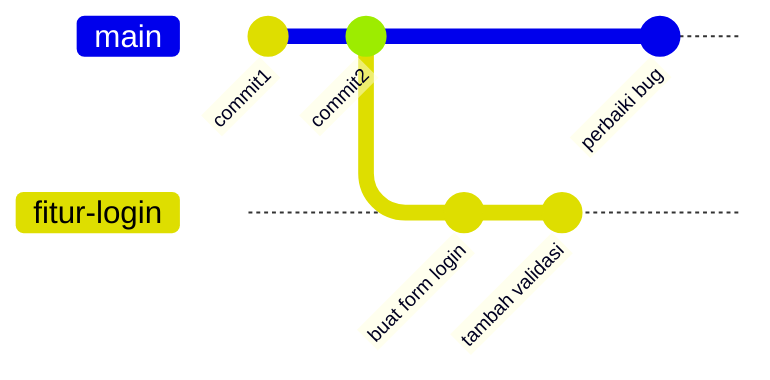
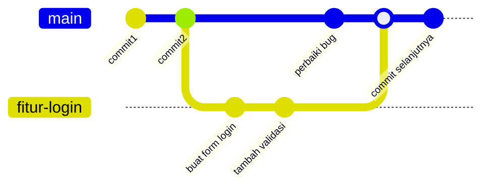
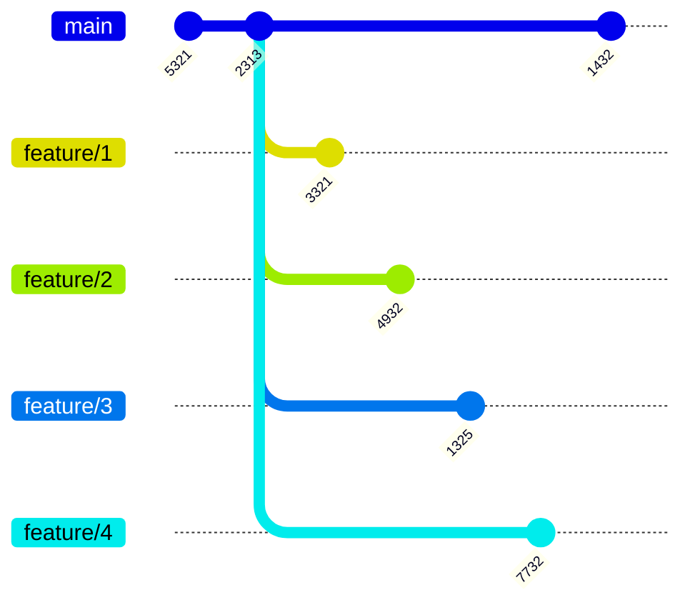
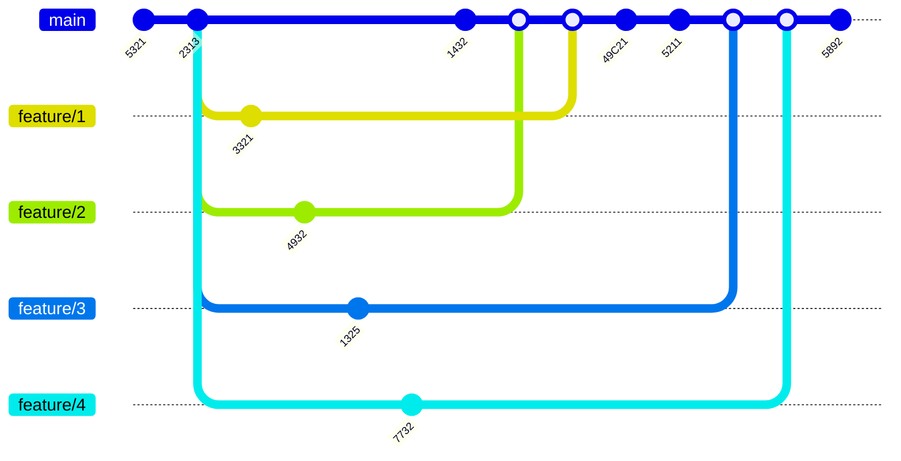

# 🔀 Git Merge - Menggabungkan Branch

## 📚 Apa itu Merge?

**Merge** adalah proses menggabungkan dua buah branch dalam Git. Bayangkan Anda memiliki dua jalur pengembangan yang berbeda, dan Anda ingin menyatukannya kembali.

### 🎯 Kapan Kita Menggunakan Merge?

- ✅ Setelah selesai membuat fitur baru di branch terpisah
- ✅ Ingin menggabungkan kode dari branch fitur ke branch utama (misalnya `main` atau `master`)
- ✅ Saat ingin mengintegrasikan pekerjaan dari beberapa developer

### 💡 Hal Penting tentang Merge

- 🔄 **Branch tidak otomatis terhapus** setelah di-merge
- 📝 Anda masih bisa melakukan commit di branch yang sudah di-merge
- 🗑️ Jika ingin menghapus branch, harus dilakukan **secara manual**

---

## 🛠️ Cara Melakukan Merge

### Langkah 1️⃣: Pindah ke Branch Tujuan

Pertama, pindah ke branch yang akan **menerima** hasil merge. Biasanya ini adalah branch utama seperti `main` atau `master`.

```bash
git checkout main
```

**Penjelasan:** Perintah ini memindahkan Anda ke branch `main`. Branch inilah yang akan menerima perubahan dari branch lain.

### Langkah 2️⃣: Lakukan Merge

Setelah berada di branch tujuan, gunakan perintah merge:

```bash
git merge namabranch
```

**Penjelasan:** 
- `namabranch` adalah nama branch yang ingin Anda gabungkan
- Perintah ini akan menggabungkan semua commit dari `namabranch` ke branch Anda saat ini

### 📌 Contoh Praktis

Misalnya Anda punya branch `fitur-login` dan ingin menggabungkannya ke `main`:

```bash
# 1. Pindah ke branch main
git checkout main

# 2. Merge branch fitur-login ke main
git merge fitur-login
```

**Hasil:** Semua perubahan dari branch `fitur-login` sekarang ada di branch `main`! 🎉

---

## 📊 Visualisasi Merge

### Sebelum Merge



**Penjelasan visualisasi:**
- 🔴 Branch `main` memiliki commit1, commit2, dan perbaiki bug
- 🔵 Branch `fitur-login` dibuat dari commit2
- 🔵 Di branch `fitur-login`, ada 2 commit baru (form login dan validasi)

### Setelah Merge



**Penjelasan:**
- ✅ Branch `fitur-login` sudah di-merge ke `main`
- ✅ Semua perubahan dari `fitur-login` sekarang ada di `main`
- ✅ Branch `fitur-login` masih tetap ada (tidak terhapus otomatis)

---

## 📋 Tugas Praktik

**Tantangan:** Merge 4 branch feature ke branch master!

### Branch yang Perlu Di-merge:
1. 🟢 `feature/1`
2. 🔵 `feature/2`
3. 🟣 `feature/3`
4. 🟤 `feature/4`

### Visualisasi Tugas

**Kondisi Awal:**



**Setelah Semua Di-merge:**



### 🎯 Langkah-langkah Mengerjakan Tugas:

```bash
# 1. Pastikan Anda di branch master
git checkout master

# 2. Merge feature/1
git merge feature/1

# 3. Merge feature/2
git merge feature/2

# 4. Merge feature/3
git merge feature/3

# 5. Merge feature/4
git merge feature/4
```

**Selamat!** 🎊 Anda telah berhasil menggabungkan 4 branch feature ke master!

---

## 📈 Melihat History Merge dengan Graph

Setelah melakukan merge, Anda bisa melihat visualisasi history commit dalam bentuk graph:

```bash
git log --oneline --graph
```

**Penjelasan perintah:**
- 📊 `--graph` : Menampilkan visualisasi branch dan merge dalam bentuk ASCII
- 📝 `--oneline` : Menampilkan setiap commit dalam satu baris agar lebih ringkas

### Contoh Output:

```
*   5892a1b (HEAD -> master) Merge feature/4
|\  
| * 7732c4d (feature/4) Implementasi feature 4
* |   5211f3e Merge feature/3
|\ \  
| * | 1325b2a (feature/3) Implementasi feature 3
| |/  
* | 49C21ab Update master
|/  
*   1432e5f Merge feature/2
|\  
| * 4932d7c (feature/2) Implementasi feature 2
* | 2313c8e Update config
|/  
* 5321a9b Initial commit
```

**Penjelasan output:**
- ⭐ `*` menandakan commit
- 🔀 Garis miring (`/`, `\`, `|`) menunjukkan alur branch dan merge
- 🏷️ `(HEAD -> master)` menunjukkan posisi Anda saat ini
- 🏷️ `(feature/1)`, `(feature/2)`, dll menunjukkan nama branch

---

## 💡 Tips untuk Pemula

1. **Selalu commit dulu** sebelum melakukan merge
2. **Pastikan berada di branch yang benar** sebelum merge (gunakan `git branch` untuk cek)
3. **Backup dulu** jika ragu - bisa dengan membuat branch baru
4. **Jangan panik** jika ada conflict - itu normal dan bisa diselesaikan (akan dibahas di materi selanjutnya)

---

## 🎓 Rangkuman

✅ **Merge** = Menggabungkan dua branch  
✅ **Branch tidak terhapus** setelah di-merge  
✅ **Perintah utama**: `git merge namabranch`  
✅ **Lihat history**: `git log --oneline --graph`  
✅ **Selalu merge di branch tujuan**, bukan di branch sumber  

Selamat belajar! 🚀
