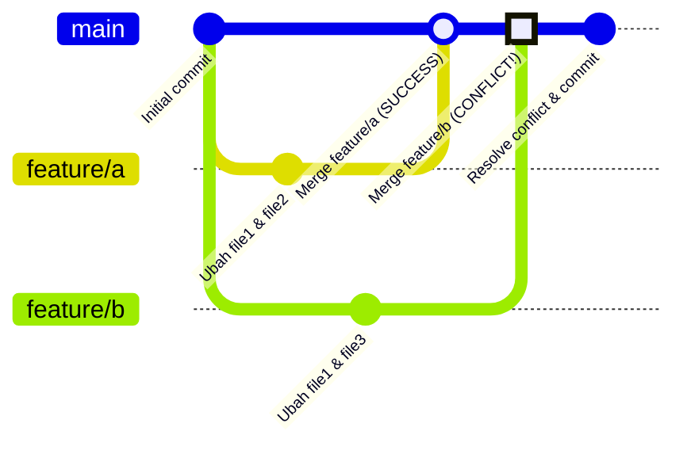

# 🔀 Merge Conflict

## 📖 Apa itu Merge Conflict?

**Merge Conflict** adalah situasi yang terjadi ketika Git tidak bisa secara otomatis menggabungkan perubahan dari dua branch yang berbeda. Ini adalah hal yang **normal** dan sering terjadi dalam pengembangan tim!

### 🤔 Kenapa Merge Conflict Bisa Terjadi?

- Dalam pembuatan aplikasi, biasanya setiap programmer akan melakukan penambahan kode program di Repository secara parallel (bersamaan)

- Biasanya tiap programmer akan membuat branch masing-masing untuk fitur yang berbeda

- Dan tidak bisa dihindari, kadang programmer akan melakukan perubahan pada **kode file yang sama** di branch berbeda

- Dan biasanya ketika melakukan merge, akan terjadi yang namanya **conflict** ⚠️

- Hal ini disebabkan, satu file diubah di branch yang berbeda, sehingga ketika di merge, kita perlu melakukan yang namanya **Merge Conflict Resolution** (menyelesaikan konflik)

---

## 📝 Tugas Praktik: Membuat Merge Conflict

Mari kita buat skenario untuk memahami merge conflict:

### Langkah-langkah:

1️⃣ **Buat dua branch dari branch utama**
   - Branch pertama untuk fitur A
   - Branch kedua untuk fitur B

2️⃣ **Branch feature/a mengubah file 1 dan file 2**
   - Fokus pada pengembangan fitur A
   - Memodifikasi dua file berbeda

3️⃣ **Branch feature/b mengubah file 1 dan file 3**
   - Fokus pada pengembangan fitur B
   - ⚠️ Perhatikan: file 1 juga diubah (sama seperti di feature/a)

4️⃣ **Merge branch feature/a ke branch utama**
   - Merge pertama biasanya akan berhasil ✅

5️⃣ **Merge branch feature/b ke branch utama**
   - ❌ Hal ini akan memicu conflict!
   - Karena file 1 diubah di kedua branch

---

## 🚫 Membatalkan Conflict

Jika terjadi conflict dan kamu merasa **belum siap** untuk menyelesaikannya, kamu bisa membatalkannya terlebih dahulu.

### 💡 Yang Perlu Diketahui:

- ✅ **Semua perubahan yang tidak konflik** akan secara otomatis berada di **Staging Index**

- ⚠️ **Perubahan yang konflik** akan secara otomatis berada di **Working Directory**

### 🔧 Cara Membatalkan Merge:

Jika kita ingin membatalkan merge, kita bisa gunakan perintah:

```bash
git merge --abort
```

**Efek perintah ini:**
- Secara otomatis semua perubahan di branch yang ingin kita merge akan dihapus
- Repository kembali ke kondisi sebelum merge dimulai
- Tidak ada perubahan yang tersimpan

> 💡 **Tips**: Gunakan perintah ini jika kamu butuh waktu lebih untuk memikirkan cara terbaik menyelesaikan conflict!

---

## 🛠️ Memperbaiki Conflict

### 📌 Hal Penting:

- ❌ **Tidak ada cara otomatis** untuk memperbaiki conflict

- 👨‍💻 **Kita perlu memperbaiki conflict secara manual**
   - Git menandai bagian yang conflict
   - Programmer harus memutuskan kode mana yang dipertahankan

- ✅ Dan jika perbaikan conflict sudah dilakukan, maka kita perlu melakukan **commit perubahan tersebut**
   - Ini menandakan bahwa conflict telah diselesaikan
   - Merge process akan dilanjutkan

---

## 📄 File Conflict: Bagaimana Bentuknya?

Ketika terjadi conflict, Git akan menandai bagian yang bermasalah di dalam file. Berikut contohnya:

```
file1.txt

1  Ini adalah file 1
2  Menambah baris di file1.txt
3  Feature 1
   Accept Current Change | Accept Incoming Change | Accept Both Changes | Compare Changes
4  <<<<<<< HEAD (Current Change)
5  Perubahan Feature A
6  =======
7  Perubahan Feature B
8  >>>>>>> feature/b (Incoming Change)
9
```

### 🔍 Penjelasan Marker Conflict:

- **`<<<<<<< HEAD`** 
  - Menandai awal perubahan dari branch kamu saat ini (Current Change)
  - Perubahan yang sudah ada di branch utama

- **`=======`** 
  - Pemisah antara dua perubahan yang conflict

- **`>>>>>>> feature/b`** 
  - Menandai akhir perubahan dari branch yang ingin di-merge (Incoming Change)
  - Perubahan baru yang ingin digabungkan

### ✏️ Cara Menyelesaikan:

1. **Pilih salah satu:** Hapus salah satu perubahan yang tidak diinginkan
2. **Gabungkan keduanya:** Edit manual untuk menggabungkan kedua perubahan
3. **Tulis ulang:** Buat solusi baru yang lebih baik
4. **Hapus marker:** Hapus semua marker (`<<<<<<<`, `=======`, `>>>>>>>`)
5. **Save & commit:** Simpan file dan commit perubahan

---

## 📊 Visualisasi Merge Conflict

Diagram berikut menunjukkan alur terjadinya merge conflict:



### 📖 Penjelasan Diagram:

1. **Initial commit** 
   - Titik awal repository

2. **Branch feature/a & feature/b dibuat**
   - Dua programmer bekerja secara parallel

3. **Kedua branch mengubah file1**
   - Ini yang menyebabkan conflict!
   - file1 diubah di dua tempat berbeda

4. **Merge feature/a → SUCCESS ✅**
   - Merge pertama berhasil tanpa masalah

5. **Merge feature/b → CONFLICT! ⚠️**
   - Git menemukan file1 sudah diubah di main (oleh feature/a)
   - Conflict terjadi karena ada dua versi berbeda dari file1

6. **Resolve conflict & commit 🎯**
   - Programmer menyelesaikan conflict secara manual
   - Melakukan commit untuk menyelesaikan merge

---

## 🎯 Ringkasan

### ✅ Yang Harus Diingat:

1. Merge conflict adalah hal **normal** dalam kolaborasi tim
2. Conflict terjadi ketika file yang sama diubah di branch berbeda
3. Kamu bisa **membatalkan** merge dengan `git merge --abort`
4. Untuk menyelesaikan conflict, kamu harus **edit manual** file yang conflict
5. Setelah selesai, **commit** perubahan untuk menyelesaikan merge

### 💪 Tips untuk Pemula:

- 🔍 **Selalu cek status** dengan `git status` untuk melihat file yang conflict
- 📝 **Komunikasi dengan tim** sebelum merge untuk menghindari conflict besar
- 🧪 **Practice makes perfect** - semakin sering menangani conflict, semakin mudah!
- 💾 **Backup dulu** jika ragu, gunakan `git merge --abort` untuk kembali ke awal

---

> 🚀 **Selamat!** Kamu sekarang memahami dasar-dasar Merge Conflict. Jangan takut dengan conflict, karena ini adalah bagian penting dari kolaborasi dalam Git!
