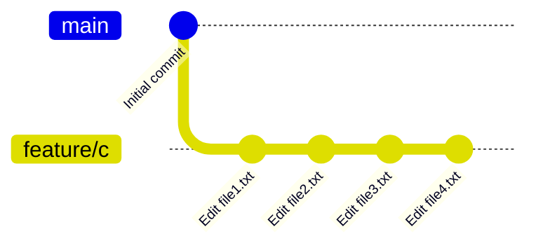
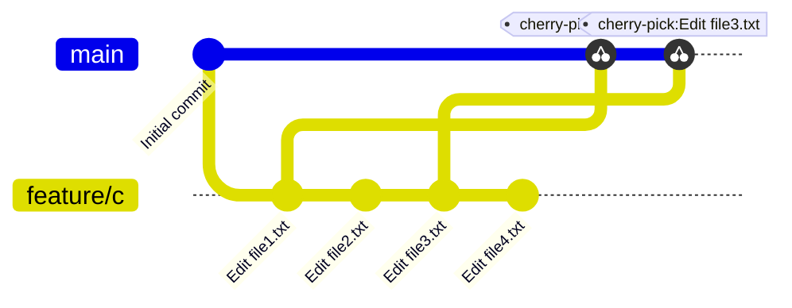

# 🍒 Cherry Pick

## 📚 Apa itu Cherry Pick?

**Cherry Pick** adalah fitur Git yang memungkinkan kita untuk mengambil commit tertentu dari branch manapun dan menggabungkannya ke branch yang sedang aktif.

### 🤔 Kapan Menggunakan Cherry Pick?

Bayangkan situasi ini:
- Kamu membuat kode program di branch `feature/c`
- Kamu ingin melakukan merge ke branch `main`
- **TAPI**, kamu tidak ingin merge **semua perubahan**
- Kamu hanya ingin mengambil **beberapa commit tertentu saja**

Nah, di sinilah **Cherry Pick** berguna! 🎯

---

## 🎯 Tugas Praktik

Mari kita praktik step by step:

1. **Buat branch baru** bernama `feature/c`
2. **Edit file1.txt** lalu commit
3. **Edit file2.txt** lalu commit  
4. **Edit file3.txt** lalu commit
5. **Edit file4.txt** lalu commit

### 📊 Visualisasi Struktur Branch

Setelah mengikuti langkah di atas, struktur branch kamu akan terlihat seperti ini:



> 💡 **Penjelasan Diagram:**
> - Branch `main` memiliki commit awal
> - Branch `feature/c` memiliki 4 commit baru (file1, file2, file3, file4)
> - Kita sekarang berada di branch `main`

---

## 🔧 Cara Melakukan Cherry Pick

### 📝 Skenario

Misalkan sekarang kita ingin:
- ✅ Merge perubahan di **file1.txt** 
- ✅ Merge perubahan di **file3.txt**
- ❌ **TIDAK** merge file2.txt dan file4.txt

### ⚡ Perintah Cherry Pick

Gunakan perintah berikut:

```bash
git cherry-pick <commitId>
```

> 📌 **Catatan:** 
> - Ganti `<commitId>` dengan ID commit yang ingin kamu ambil
> - Kamu bisa melihat commit ID dengan perintah `git log`

### 📊 Visualisasi Hasil Cherry Pick

Setelah melakukan cherry pick untuk file1.txt dan file3.txt, struktur branch akan terlihat seperti ini:



> 💡 **Penjelasan Diagram:**
> - Branch `main` sekarang memiliki commit dari file1.txt dan file3.txt
> - Commit file2.txt dan file4.txt tetap **hanya** ada di branch `feature/c`
> - Kita berhasil mengambil commit tertentu tanpa merge seluruh branch! 🎉

---

## ✨ Kesimpulan

- 🍒 **Cherry Pick** = Mengambil commit tertentu dari branch lain
- 🎯 **Kegunaan** = Ketika kamu hanya butuh sebagian perubahan, bukan semuanya
- 💪 **Fleksibel** = Kamu yang menentukan commit mana yang ingin diambil

> ⚠️ **Tips untuk Pemula:**
> Gunakan cherry pick dengan hati-hati! Pastikan kamu memahami commit mana yang ingin diambil agar tidak terjadi konflik atau kesalahan.
