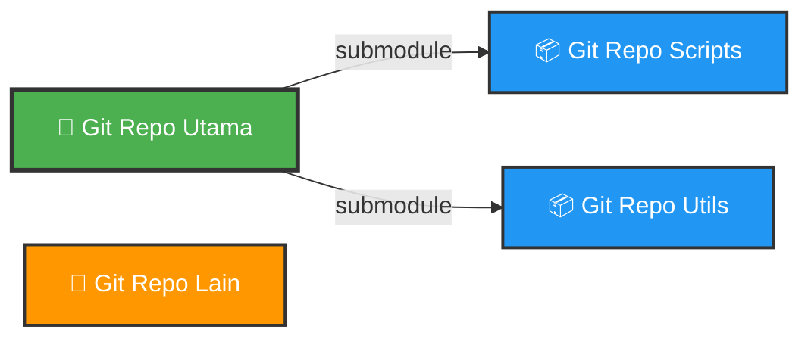

# 📦 Git Submodule - Panduan Lengkap untuk Pemula

## 🎯 Apa itu Submodule?

Git Submodule adalah fitur yang memungkinkan kita untuk **menyertakan repository Git lain di dalam repository Git kita**. Bayangkan seperti ini:

- 🏗️ Saat kita membuat project aplikasi, kadang kita ingin membuat **library yang berisi kode program** yang ingin digunakan di beberapa aplikasi berbeda

- ✨ Pada kasus seperti ini, **fitur Git Submodule sangat bermanfaat**

- 🔗 Git Submodule memungkinkan kita **menambahkan git repository ke git repository yang lain**, atau dinamakan submodule

- 🎪 Dengan menggunakan submodule, kita bisa melakukan **management git repository terpisah**, namun kita bisa **mengakses git repository lain**

---

## 📊 Diagram Submodule

Berikut visualisasi bagaimana Git Submodule bekerja:



**💡 Penjelasan Diagram:**
- Repository utama (hijau) dapat memiliki beberapa submodule
- Setiap submodule (biru) adalah repository Git yang terpisah
- Repository lain (oranye) adalah repository independen yang tidak terhubung

---

## ➕ Menambah Submodule

### 📝 Cara Menambahkan

Untuk menambah submodule ke dalam git repository, gunakan perintah berikut:

```bash
git submodule add <url-git-repo> <nama-folder>
```

**🔍 Contoh Praktis:**

```bash
git submodule add https://github.com/user/automation-scripts.git scripts
```

**📤 Output:**
```
Cloning into 'scripts'...
remote: Enumerating objects: 125, done.
remote: Counting objects: 100% (125/125), done.
remote: Compressing objects: 100% (89/89), done.
remote: Total 125 (delta 45), reused 98 (delta 32)
Receiving objects: 100% (125/125), 45.23 KiB | 2.21 MiB/s, done.
Resolving deltas: 100% (45/45), done.
```

### ⚙️ Apa yang Terjadi?

- 🚀 Secara otomatis semua git repository submodule tersebut akan di-clone ke dalam folder `scripts`

- 📄 Git akan membuat file **`.gitmodules`** yang menyimpan informasi tentang submodule

**📄 Contoh isi file `.gitmodules`:**
```ini
[submodule "scripts"]
    path = scripts
    url = https://github.com/user/automation-scripts.git
```

---

## 🗂️ Submodule Repository

### 🎭 Bekerja dengan Submodule

- 📂 Saat kita **masuk ke folder submodule**, sebenarnya akan seperti **berada di project git repository submodule tersebut**

- 🛠️ Kita bisa melakukan **management git repository di submodule** tersebut, seperti melakukan commit, mengelola branch, dan operasi Git lainnya

### ⚠️ Best Practice

> **🚨 Penting!** Namun **tidak disarankan** untuk melakukan perubahan di submodule. 
> 
> 💡 **Lakukanlah perubahan langsung di git repository aslinya**, anggap submodule hanya digunakan untuk **menduplikasi perubahan** yang terjadi di git repository sumber asli nya.

---

## 🔄 Update Submodule

### 🆕 Mendapatkan Perubahan Terbaru

Jika ada perubahan di repository submodule, kita perlu update untuk mendapatkan versi terbaru:

#### 1️⃣ Update Submodule Spesifik

```bash
git submodule update --remote scripts
```

**📤 Output:**
```
Submodule path 'scripts': checked out 'a1b2c3d4e5f6g7h8i9j0k1l2m3n4o5p6q7r8s9t0'
```

#### 2️⃣ Update Semua Submodule

```bash
git submodule update --remote
```

**📤 Output:**
```
Submodule path 'scripts': checked out 'a1b2c3d4e5f6g7h8i9j0k1l2m3n4o5p6q7r8s9t0'
Submodule path 'utils': checked out 'b2c3d4e5f6g7h8i9j0k1l2m3n4o5p6q7r8s9t0u1'
```

#### 3️⃣ Update Manual

```bash
cd scripts              # Masuk ke folder submodule
git pull origin main    # Pull perubahan terbaru
cd ..                   # Kembali ke repository utama
```

---

## 📥 Clone Repository dengan Submodule

### 🎬 Langkah-langkah Clone

Ketika kita clone repository yang memiliki submodule, ada **langkah tambahan** yang perlu dilakukan:

**Langkah 1:** Clone repository seperti biasa
```bash
git clone https://github.com/user/project-utama.git
cd project-utama
```

**Langkah 2:** Inisialisasi submodule
```bash
git submodule init
```

**📤 Output:**
```
Submodule 'scripts' (https://github.com/user/automation-scripts.git) registered for path 'scripts'
```

**Langkah 3:** Download submodule
```bash
git submodule update
```

**📤 Output:**
```
Cloning into 'scripts'...
Submodule path 'scripts': checked out 'a1b2c3d4e5f6g7h8i9j0k1l2m3n4o5p6q7r8s9t0'
```

### 🚀 Cara Cepat (Shortcut)

Kita bisa melakukan semuanya sekaligus saat clone:

```bash
git clone --recurse-submodules https://github.com/user/project-utama.git
```

**✨ Lebih praktis!** Semua submodule langsung ter-download.

---

## 🌿 Mengubah Branch Submodule

### 🎯 Kenapa Perlu Mengubah Branch?

Kadang kita ingin semua developer menggunakan **branch yang sama** di submodule untuk konsistensi.

### 📍 Memahami Dua Repository

Sebelum mulai, pahami bahwa ada **DUA repository** yang terlibat:

1. 🏠 **Repository Utama** (Project kita) - Contoh: `project-utama/`
2. 📦 **Repository Submodule** (Scripts yang kita pakai) - Contoh: `project-utama/scripts/`

> **⚠️ PENTING:** Kita harus membuat branch di **repository submodule** dulu, baru kemudian set branch tersebut di **repository utama**!

---

## 📦 BAGIAN 1: Persiapan di Repository Submodule

### Langkah 1.1: 📦 Masuk ke Repository Submodule

```bash
cd scripts
```

### Langkah 1.2: 🔍 Cek Branch yang Ada

```bash
git branch -a
```

**📤 Output:**
```
* main
  remotes/origin/HEAD -> origin/main
  remotes/origin/main
```

### Langkah 1.3: 🌿 Buat Branch `development` Baru

```bash
git checkout -b development
```

**📤 Output:**
```
Switched to a new branch 'development'
```

### Langkah 1.4: 🚀 Push Branch ke Remote

```bash
git push -u origin development
```

**📤 Output:**
```
Total 0 (delta 0), reused 0 (delta 0), pack-reused 0
To https://github.com/user/automation-scripts.git
 * [new branch]      development -> development
Branch 'development' set up to track remote branch 'development' from 'origin'.
```

### Langkah 1.5: 🏠 Kembali ke Repository Utama

```bash
cd ..
```

---

## 🏠 BAGIAN 2: Setting di Repository Utama

### Langkah 2.1: 📝 Set Branch Submodule

```bash
git submodule set-branch --branch development scripts
```

**📄 File `.gitmodules` akan berubah menjadi:**
```ini
[submodule "scripts"]
    path = scripts
    url = https://github.com/user/automation-scripts.git
    branch = development  ← 🎯 Baris ini ditambahkan!
```

### Langkah 2.2: 🔄 Update Submodule ke Branch Baru

```bash
git submodule update --remote scripts
```

**📤 Output:**
```
Submodule path 'scripts': checked out 'c3d4e5f6g7h8i9j0k1l2m3n4o5p6q7r8s9t0u1v2'
```

### Langkah 2.3: 💾 Commit Perubahan

```bash
git add .gitmodules scripts
git commit -m "🌿 Set submodule scripts to development branch"
```

### Langkah 2.4: 🚀 Push ke Remote

```bash
git push origin main
```

---

## 🗑️ Menghapus Submodule

### 🎯 Kapan Perlu Menghapus?

- ❌ Library sudah tidak digunakan lagi
- 🔄 Ingin mengganti dengan library lain
- 🧹 Membersihkan dependency yang tidak perlu

### 📝 Langkah-langkah Menghapus (5 Langkah Penting)

#### **Langkah 1:** 🔓 Deinit Submodule

```bash
git submodule deinit -f scripts
```

**💡 Penjelasan:**
- Membatalkan inisialisasi submodule `scripts`
- Menghapus konfigurasi dari `.git/config`
- Flag `-f` memaksa penghapusan meskipun ada perubahan yang belum di-commit

**📤 Output:**
```
Cleared directory 'scripts'
Submodule 'scripts' (https://github.com/user/automation-scripts.git) unregistered for path 'scripts'
```

---

#### **Langkah 2:** 🗑️ Hapus dari Git Tracking

```bash
git rm -f scripts
```

**💡 Penjelasan:**
- Menghapus folder `scripts` dari Git index dan working directory
- Folder `scripts` akan benar-benar hilang dari project
- Entry di `.gitmodules` akan otomatis dihapus
- Flag `-f` memaksa penghapusan

**📤 Output:**
```
rm 'scripts'
```

---

#### **Langkah 3:** 🧹 Hapus Cache Git Submodule

```bash
rm -rf .git/modules/scripts
```

**💡 Penjelasan:**
- Menghapus metadata dan cache submodule dari folder `.git/modules/`
- Membersihkan semua jejak submodule dari repository lokal
- **Sangat penting** agar tidak ada konflik saat menambahkan submodule baru

**📝 Untuk Windows (Command Prompt):**
```bash
rmdir /s /q .git\modules\scripts
```

**📝 Untuk Windows (PowerShell):**
```bash
Remove-Item -Recurse -Force .git\modules\scripts
```

---

#### **Langkah 4:** 💾 Commit Perubahan

```bash
git commit -m "🗑️ Remove scripts submodule"
```

**📤 Output:**
```
[main d5e6f7g] 🗑️ Remove scripts submodule
 2 files changed, 4 deletions(-)
 delete mode 160000 scripts
```

**💡 Penjelasan:**
- Menyimpan semua perubahan penghapusan ke dalam Git history
- Pesan commit bisa disesuaikan dengan kebutuhan

---

#### **Langkah 5:** 🚀 Push ke GitHub

```bash
git push origin main
```

**📤 Output:**
```
Enumerating objects: 3, done.
Counting objects: 100% (3/3), done.
Delta compression using up to 8 threads
Compressing objects: 100% (2/2), done.
Writing objects: 100% (2/2), 245 bytes | 245.00 KiB/s, done.
Total 2 (delta 1), reused 0 (delta 0)
To https://github.com/user/project-utama.git
   c4d5e6f..d5e6f7g  main -> main
```

**💡 Penjelasan:**
- Mengirim commit ke GitHub remote repository
- Ganti `main` dengan nama branch kamu jika berbeda (misalnya `master`)

---

### ✅ Verifikasi Penghapusan Berhasil

Setelah semua langkah di atas, cek apakah penghapusan berhasil:

```bash
# Cek isi .gitmodules (seharusnya tidak ada entry scripts)
cat .gitmodules

# Cek apakah folder scripts masih ada (seharusnya tidak ada)
ls -la

# Cek cache di .git/modules (seharusnya tidak ada folder scripts)
ls -la .git/modules/
```

**📤 Output yang diharapkan:**
```
# .gitmodules kosong atau tidak ada entry scripts
# Folder scripts tidak muncul di list
# Folder scripts tidak ada di .git/modules/
```

---

### 📋 Ringkasan Command Lengkap (Copy-Paste Ready)

```bash
# 1. Deinit submodule
git submodule deinit -f scripts

# 2. Hapus dari Git
git rm -f scripts

# 3. Hapus cache
rm -rf .git/modules/scripts

# 4. Commit
git commit -m "🗑️ Remove scripts submodule"

# 5. Push ke remote
git push origin main
```

**✅ Selesai!** Setelah semua langkah ini, folder `scripts` sudah benar-benar bersih dan kamu bisa menambahkan submodule baru dengan nama folder yang sama tanpa masalah!

---

## 📚 Rangkuman Perintah Penting

| Perintah | Fungsi | Emoji |
|----------|--------|-------|
| `git submodule add <url> <folder>` | Menambah submodule baru | ➕ |
| `git submodule init` | Inisialisasi submodule | 🔰 |
| `git submodule update` | Download/update submodule | 🔄 |
| `git submodule update --remote` | Update ke versi terbaru | 🆕 |
| `git submodule set-branch --branch <branch> <folder>` | Set branch submodule | 🌿 |
| `git clone --recurse-submodules <url>` | Clone dengan submodule | 📥 |
| `git submodule deinit -f <folder>` | Deinit submodule | 🔓 |
| `git rm -f <folder>` | Hapus dari Git tracking | 🗑️ |
| `rm -rf .git/modules/<folder>` | Hapus cache submodule | 🧹 |

---

## 💡 Tips & Best Practices

### ✅ DO (Lakukan)
- ✅ Selalu update submodule secara berkala
- ✅ Gunakan `--recurse-submodules` saat clone
- ✅ Set branch yang jelas untuk setiap submodule
- ✅ Commit perubahan `.gitmodules` ke repository
- ✅ Hapus cache dengan `rm -rf .git/modules/<folder>` saat menghapus submodule
- ✅ Verifikasi setelah menghapus submodule

### ❌ DON'T (Jangan Lakukan)
- ❌ Jangan edit kode langsung di folder submodule
- ❌ Jangan lupa init dan update setelah clone
- ❌ Jangan hapus manual tanpa mengikuti 5 langkah penghapusan
- ❌ Jangan lupa hapus cache di `.git/modules/` saat menghapus submodule

---

## 🎓 Kesimpulan

Git Submodule adalah fitur yang **powerful** untuk:
- 🔗 **Menghubungkan** beberapa repository Git
- 📦 **Mengelola** library atau dependency
- ♻️ **Reuse** kode di berbagai project
- 🎯 **Konsistensi** versi library di berbagai project

**🚀 Selamat belajar Git Submodule!** Praktikkan perintah-perintah di atas secara bertahap untuk memahami konsepnya dengan baik.

---

**📝 Catatan:** Dokumentasi ini dibuat untuk pemula. Pelajari sedikit demi sedikit dan praktikkan setiap konsep sebelum melanjutkan ke yang berikutnya.
